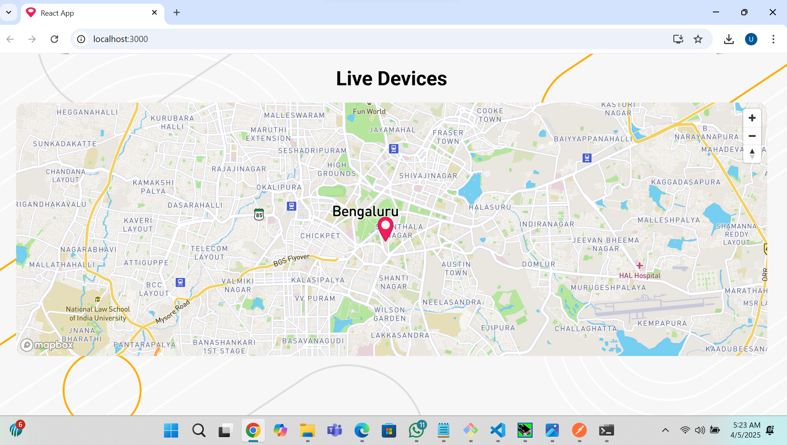

# 📍GeoTrack A Realtime GPS Tracking Web App

A real-time location tracking dashboard using **React**, **Mapbox**, and **Socket.IO** to display GPS coordinates from devices like LoRa modules via a serial interface.

---

## 🚀 Features

- 📍 Real-time GPS data rendering  
- 🔌 Socket.IO integration  
- 🗺️ Mapbox for interactive map display  
- ⚛️ Built with React and CSS Modules  
- 🛠️ Ready for future upgrades (e.g., multiple markers, live routes)

---

## 📷 Screenshot

 <!-- Replace with your actual screenshot path -->

---

## ⚙️ Getting Started

### 🔗 Live Backend Preview

You can test it live or contribute to the backend by visiting:  
👉 [https://github.com/ubaid-patel/GPS-Api](https://github.com/ubaid-patel/GPS-Api)

---

### 🛠️ Setup Instructions

> 🧩 Setup may vary depending on your GPS data source or local environment.

#### 1. Clone the Frontend

```bash
git clone https://github.com/yourusername/realtime-map-app.git
cd realtime-map-app
```
#### 2. Install dependencies

```bash
 npm install
 ```
#### 3. Replace your Mapbox Access Token
Open Map.jsx and replace this line:
```bash
mapboxgl.accessToken = 'YOUR_MAPBOX_ACCESS_TOKEN';
```
with your own Mapbox token from:
👉 https://account.mapbox.com/
#### 4. Run the App
```bash
npm start
```
The app will be live at: http://localhost:3000

Make sure your backend (Socket.IO server) is running at http://localhost:5000 or update the endpoint accordingly.


## 📦 Tech Stack

- **React**
- **Socket.IO**
- **Mapbox GL JS**
- **CSS Modules**

---

## 🧠 To-Do / Future Improvements

- 🧭 **Multiple markers support**  
- 📌 **Custom marker icons**  
- 🛣️ **Route tracking**  
- 📊 **Device status display**  
- 🕵️ **Device search & filtering**

---

## 📁 Project Structure

```plaintext
python/

src/
├── App.jsx
├── Map.jsx
├── CSS/
│   └── map.module.css
└── index.js


```

----
📝 License
MIT – Free to use, modify, and contribute.

Made with 💻 + ❤️ by Ubaid Patel