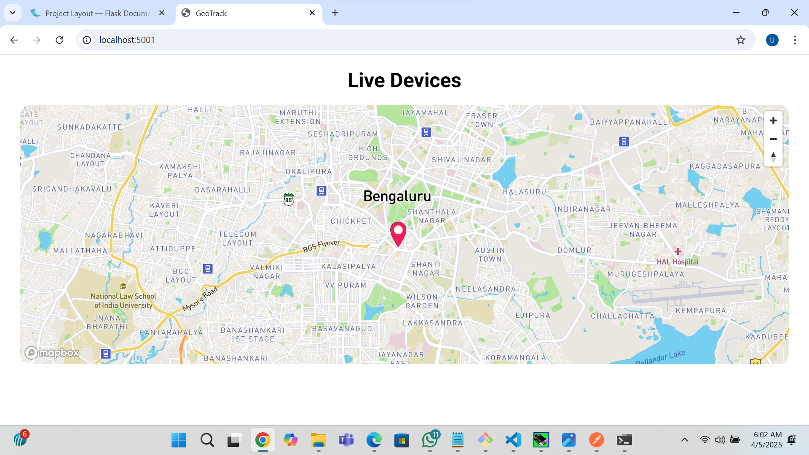

# 📍GeoTrack A Realtime GPS Tracking Web App

A real-time location tracking dashboard using **React**, **Mapbox**, and **Socket.IO** to display GPS coordinates from devices like LoRa modules via a serial interface.

---

## 🚀 Features

- 📍 Real-time GPS data rendering  
- 🔌 Socket.IO integration  
- 🗺️ Mapbox for interactive map display  
- ⚛️ Built with React and CSS Modules  
- 🛠️ Ready for future upgrades (e.g., multiple markers, live routes)

---

## 📷 Screenshot

 <!-- Replace with your actual screenshot path -->

---

## ⚙️ Getting Started

### 🔗 Live Backend Preview

You can test it live or contribute to the backend by visiting:  
👉 [./api)

---

### 🛠️ Setup Instructions

> 🧩 Setup may vary depending on your GPS data source or local environment.

#### 1. Clone the Frontend

```bash
git clone https://github.com/yourusername/realtime-map-app.git
cd realtime-map-app
```
#### 2. Install dependencies

```bash
 npm install
 ```
#### 3. Replace your Mapbox Access Token
Open Map.jsx and replace this line:
```bash
mapboxgl.accessToken = 'YOUR_MAPBOX_ACCESS_TOKEN';
```
with your own Mapbox token from:
👉 https://account.mapbox.com/
#### 4. Run the App
```bash
npm start
```
The app will be live at: http://localhost:3000

Make sure your backend (Socket.IO server) is running at http://localhost:5000 or update the endpoint accordingly.


## 📦 Tech Stack

- **React**
- **Socket.IO**
- **Mapbox GL JS**
- **CSS Modules**

---

## 🧠 To-Do / Future Improvements

- 🧭 **Multiple markers support**  
- 📌 **Custom marker icons**  
- 🛣️ **Route tracking**  
- 📊 **Device status display**  
- 🕵️ **Device search & filtering**

---

## 📁 Project Structure

```plaintext
python/

src/
├── App.jsx
├── Map.jsx
├── CSS/
│   └── map.module.css
└── index.js


```

----


# 📡 GPSocket API — Real-time GPS Data Streaming via Serial Port

A lightweight Python-based API for receiving live GPS coordinates over a serial port (from LoRa or RF modules) and broadcasting them via **Socket.IO** for consumption by any frontend or processing system.

---

## 🚀 Features

- 🔌 Reads live GPS data from serial (e.g., LoRa, RF)
- 📤 Streams data in real-time over **Socket.IO**
- 🐍 Built with **Flask** + **pyserial**
- ⚙️ Works with virtual serial port emulators like **VSPE**
- 💡 Simple, extendable Python codebase

---

## ⚙️ Requirements

- Python 3.x
- [VSPE (Virtual Serial Port Emulator)](http://www.eterlogic.com/Products.VSPE.html) (for simulation/testing)

### 📦 Python Dependencies

Install using pip:
You can use the requirements.txt:
```bash
pip install -r requirements.txt

```
# 🛠️ Setup Instructions

## 1. Configure Serial Port
Connect your LoRa or RF module to a COM port (e.g., `COM1`).

If you're simulating, use VSPE:
- Create a virtual port pair (e.g., `COM1 ↔ COM2`).
- Assign your sender script or hardware to one end.
- The API will read from the other (e.g., `COM1`).

## 2. Run the API Server
```bash
python server.py
```
---

#### ⚠️ Make sure to update the COM port (COM1) in server.py if you're using a different one.
---

## 🔁 Sample Output via Socket.IO
The server will emit GPS data like:
```json
{
  "event": "gps_data",
  "data": "LAT:12.9716,LON:77.5946"
}
```
You can listen for this in any Socket.IO-compatible client (React, Node.js, Python, etc.)

📝 License
MIT – Free to use, modify, and distribute.

Made with 💻 + ❤️ by Ubaid Patel
📝 License
